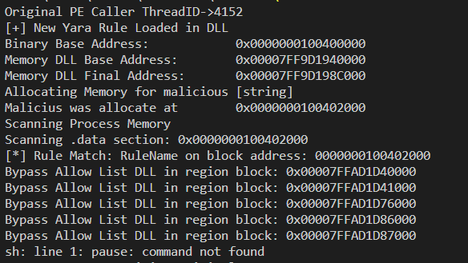

Example project that serves as a proof of concept of a DLL that can scan the process that loaded it with Yara rules(**libyara**), without generating redundant false positives. It is worth mentioning that in the current version STACK/HEAP regions are not analyzed (but you can add this whenever you want by changing line #125(entrypoint anddress) to zero.

This can be useful for process protection projects that are targets of changes in memory region (in runtime, ex: cheat, stealers, mods, etc) of libraries or starting from binary base anddress. In this example code, I put a code block that inside the DLL that inject the malicious ascii string in the process with *VirtualProtectEx* and *WriteProcessMemory*. 

To run this sample you just need to load the DLL with LoadLibrary call and the scanner will start immediate in another thread. 
```
HINSTANCE hProc = LoadLibrary(".\\memoryscanner.dll");
```

<p align="center">

</p>
